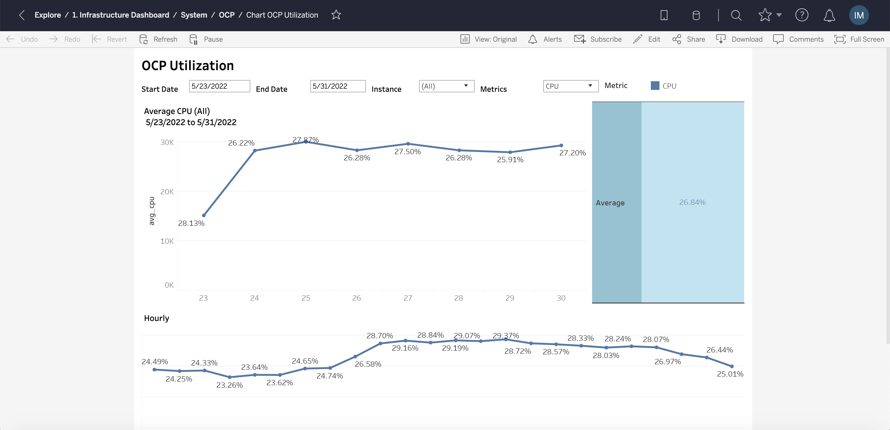

<title>OCP Documentation</title> 
IT Transaction Management 

;;;

# Chart OCP Utilization

## Overview
### keren sih
#### wagela
Dashboard Chart OCP Utilization adalah visualisai report yang menampilkan informasi Sebagai Berikut : 
- Average Utilization metrics (CPU, Memory, Disk) by date & hourly 

## Dashboard Server
1. Report Directory  
https://apptabjmb01.corp.bankbtpn.co.id/#/site/ITTransactionManagement/views/OCP/ChartOCPUtilization?:iid=4 
2. Tampilan Report 

# ganteng jawa
## kwkw
